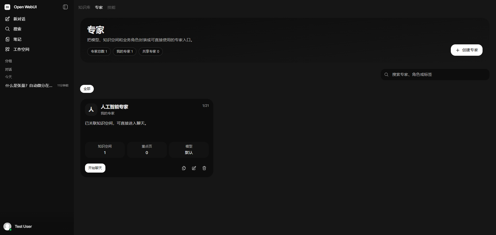
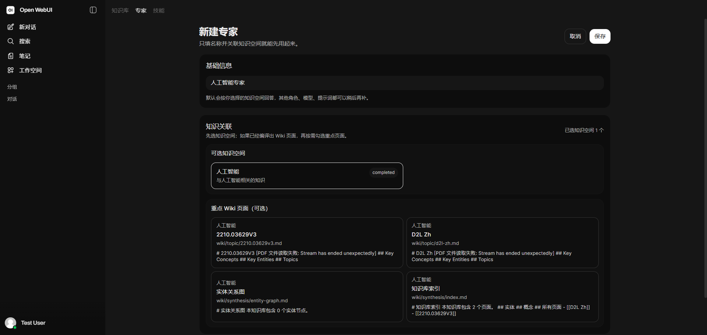
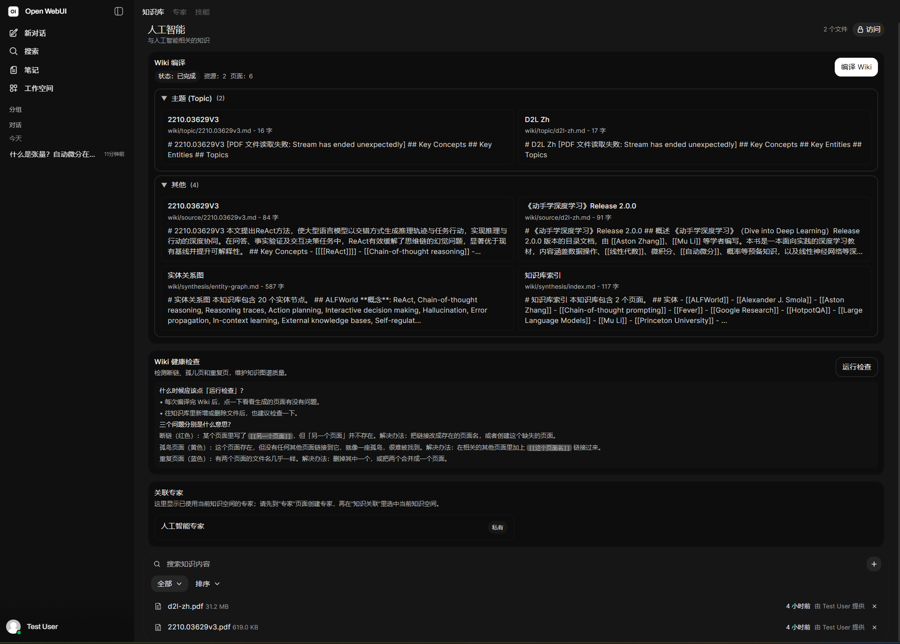
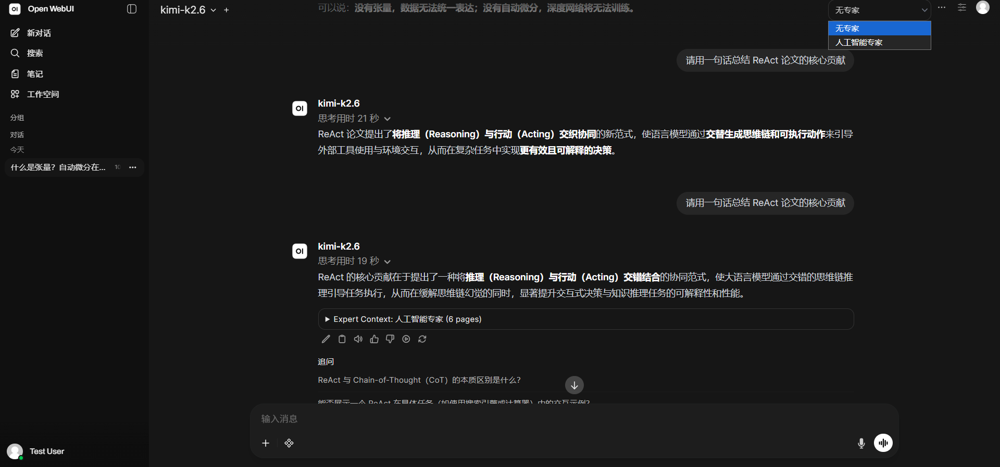
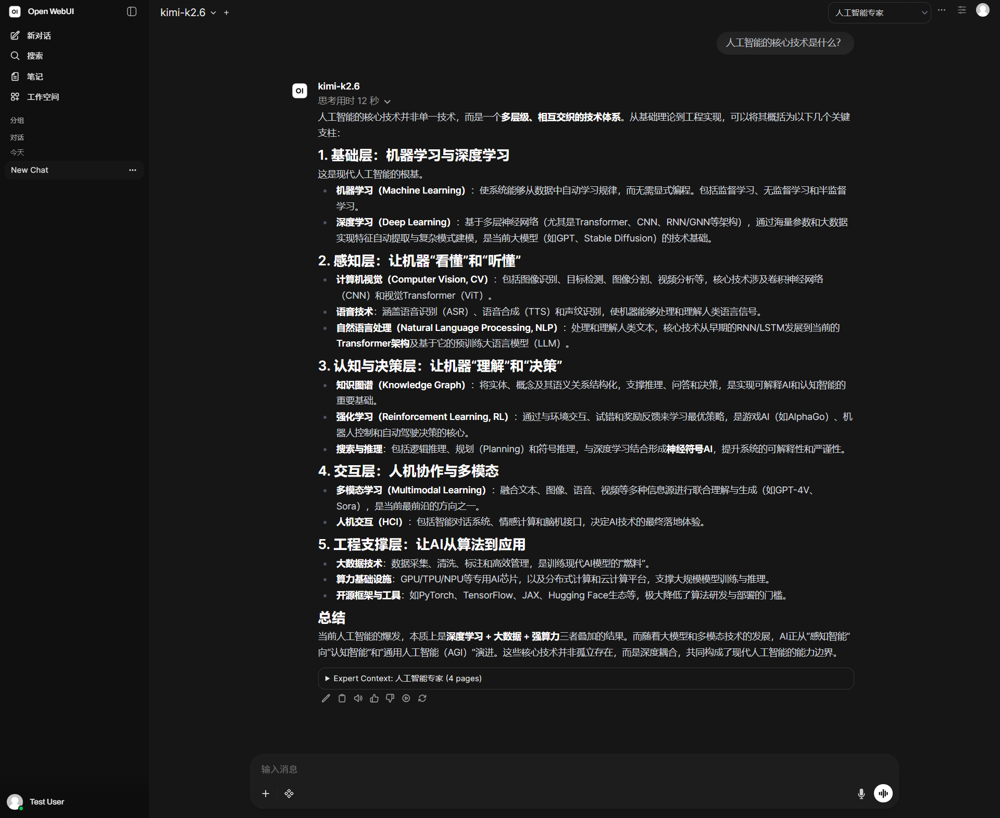

# Expert Platform OS


基于 [OpenWebUI](https://github.com/open-webui/open-webui) 扩展的**企业级 AI 专家平台**。
支持角色化专家答疑与 Obsidian 兼容的 Wiki 知识库，基于 **Karpathy llm-wiki 方法论**构建知识图谱。

[📖 部署文档](#快速部署) · [📺 演示视频（录制中）](#功能演示)

---

## 与 OpenWebUI 原版的区别

| 功能 | OpenWebUI 原版 | Expert Platform OS |
|------|---------------|-------------------|
| 交互方式 | 通用聊天 | **角色化专家答疑** |
| 知识管理 | 文件上传 | **Obsidian 双向链接 Wiki** |
| 企业权限 | 基础 | **工作空间级隔离** |
| 知识编译 | 无 | **llm-wiki 预编译优化** |

---

## 核心功能

### 🧠 专家智能体
- 创建 AI 专家角色（如"仓库管理专家"、"财务审核专家"）
- 关联知识库，实现领域专用回答
- 支持私有/共享模式，团队共享专家资源
- 基于知识图谱的语义检索，理解实体关系

### 📚 知识库（Obsidian 兼容）
- 上传文档、网页、文本等多种格式
- LLM 自动分析并生成结构化 Wiki 页面
- **自动生成 `[[wikilinks]]` 双向链接**，构建知识网络
- **Obsidian 直接导入使用**，无需二次转换
- 页面分类：实体、概念、主题、对比、查询等
- **跨文档综合**，自动生成知识索引和关系总览
- Entity-Concept 关系图谱，支持图遍历检索

### 👥 工作空间
- 知识库 / 专家 / 技能三大模块
- 细粒度权限控制，管理员统一管理
- 响应式设计，支持 PC / 平板 / 手机

### 🔗 API 兼容
- 支持任意 OpenAI 兼容 API（智谱、海螺、MiniMax 等）
- 支持本地 Ollama 模型
- 无需显卡，纯 CPU 即可运行

## 功能演示

### 1. 角色化专家系统
创建 AI 专家角色，绑定知识空间，实现领域专用回答。



### 2. 专家关联 Wiki 知识库
新建专家时一键关联知识空间，按需勾选重点 Wiki 页面。



### 3. PDF 自动编译为 Wiki
上传 PDF/Word/Excel，自动编译为结构化 Wiki 页面（Obsidian 兼容），自动生成 `[[wikilinks]]` 双向链接。



### 4. 知识库增强 vs 通用回答
同一问题，有无 Expert 的回答质量差异显著。Expert 自动注入 Wiki 上下文。



### 5. 结构化领域回答
Expert 基于 Wiki 知识图谱生成结构化回答，支持追问与知识溯源。



---

## 设计理念

**一次编译，处处使用**：
- Wiki 编译产出的就是 Obsidian 直接能用的 vault
- Expert Platform 直接读取 Wiki 目录，无需二次导入
- 摈弃传统 RAG，拥抱知识图谱

## 快速部署

### 环境要求
- Docker & Docker Compose
- 1核2G内存以上

### 一键部署
```bash
git clone https://github.com/sLeep133/expert-platform-os.git
cd expert-platform-os
docker compose -f docker-compose.webui-only.yaml up -d
```

访问 `http://localhost:3000`

### 更新版本
```bash
cd expert-platform-os
git pull origin main
docker compose -f docker-compose.webui-only.yaml up -d --build
```

## 配置大模型

1. 进入「专家」页面，创建或编辑专家
2. 在「LLM 配置」中填写：
   - **API Base**: 如 `https://api.minimaxi.com/v1`
   - **API Key**: 你的 API Key
   - **Model**: 模型名称，如 `abab6.5s-chat`

## 项目结构

```
expert-platform-os/
├── backend/
│   └── open_webui/
│       └── knowledge/
│           ├── compiler.py    # Karpathy llm-wiki 编译器
│           ├── wiki.py       # Wiki 读写和检索
│           └── llm.py        # LLM 调用
├── src/                     # 前端源码
├── docs/                    # 文档
├── Dockerfile
├── docker-compose.webui-only.yaml  # 简化部署配置
└── deploy-simple.sh         # 一键部署脚本
```

## 技术栈

- **前端**: SvelteKit + TailwindCSS
- **后端**: Python FastAPI + SQLAlchemy
- **数据库**: SQLite（默认）/ PostgreSQL
- **知识图谱**: 原生 Markdown + Wikilinks（Obsidian 兼容）

## 声明

本项目基于 [OpenWebUI](https://github.com/open-webui/open-webui)（MIT 协议）进行扩展开发。

**自研模块**：
- 专家智能体系统（角色定义、知识库绑定、权限控制）
- Wiki 知识库与编译器（Obsidian 兼容、llm-wiki 优化）

上游代码版权归属原项目作者。

---

## Star History

如果这个项目对你有帮助，请点个 ⭐️，让更多人发现它。

[](https://star-history.com/#sLeep133/expert-platform-os&Date)

## License

MIT License
